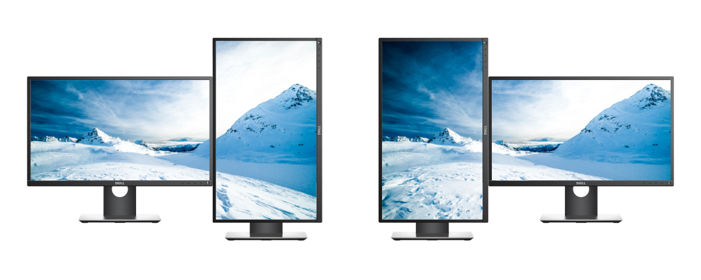

# Dual Wallpapers
_A collection of wallpapers for dual (16:9 ratio) screens_

## How to Use
These wallpapers are currently designed for two horizontal screens:

Or for a horizontal and a vertical setup like this:

You can click on one of the thumbnails below to be taken to the folder containing the wallpapers for that image or you can download the whole repository and browse through the `wallpapers` folder.

## Wallpapers
| | |
|-|-|
|||

## Other Links
- [Unsplash Wallpapers](https://unsplash.com/wallpaper) - I get all (most?) of my wallpapers from [here](https://unsplash.com/wallpaper/1339090/4k-wallpapers).
- [Twelve South - Dual-Screen Backgrounds](https://www.twelvesouth.com/wallpaper) - similar project; has options for different screen sizes but no vertical wallpapers.
